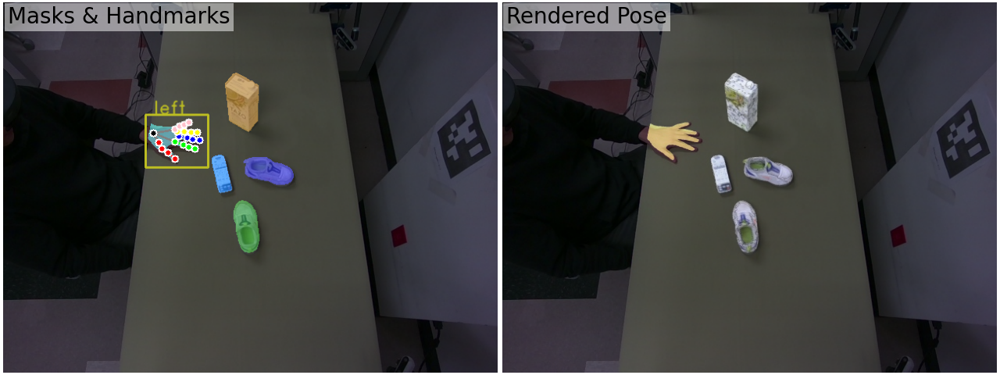
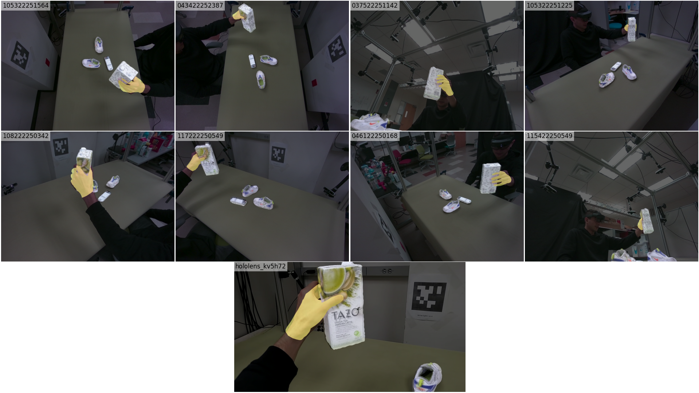
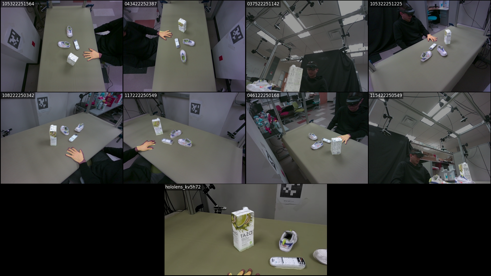
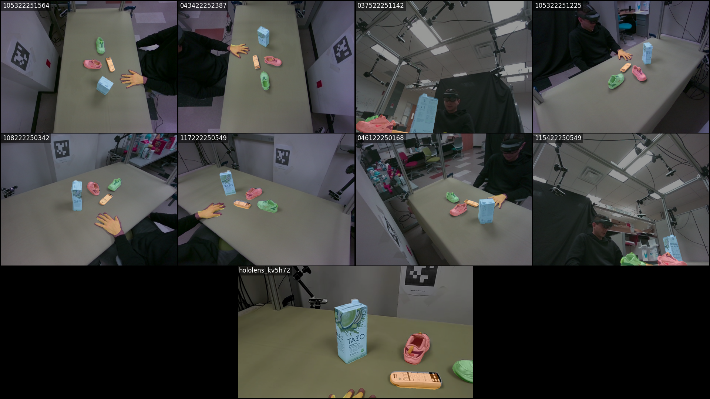
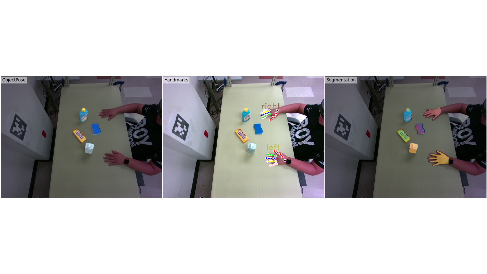

# HOCap Toolkit

[](https://www.python.org/downloads/release/python-31015/) [](https://pytorch.org/) [](https://developer.nvidia.com/cuda-toolkit/) [](http://wiki.ros.org/melodic/) 

The HOCap Toolkit is a Python package that provides evaluation and visualization tools for the HO-Cap dataset.

---

**HO-Cap: A Capture System and Dataset for 3D Reconstruction and Pose Tracking of Hand-Object Interaction**

Jikai Wang, Qifan Zhang, Yu-Wei Chao, Bowen Wen, Xiaohu Guo, Yu Xiang

[ [arXiv](https://arxiv.org/abs/2406.06843) ] [ [Project page](https://irvlutd.github.io/HOCap/) ]


---

## Contents

- [HOCap Toolkit](#hocap-toolkit)
  - [Contents](#contents)
  - [News](#news)
  - [BibTeX Citation](#bibtex-citation)
    - [License](#license)
  - [Installation](#installation)
  - [Download the HOCap Dataset](#download-the-hocap-dataset)
  - [Labels in the HOCap Dataset](#labels-in-the-hocap-dataset)
  - [Loading Dataset and Visualizing Samples](#loading-dataset-and-visualizing-samples)
  - [Evaluation](#evaluation)
    - [Hand Pose Estimation Evaluation](#hand-pose-estimation-evaluation)
    - [Object Pose Estimation Evaluation](#object-pose-estimation-evaluation)
    - [Object Detection Evaluation](#object-detection-evaluation)
  - [HOCap Dataset Split for Training and Testing](#hocap-dataset-split-for-training-and-testing)

## News
- :warning::warning: **2025-01-13**: We fixed the bug in image labels for "hand_joints_3d" and "hand_joints_2d". Please **re-download** the [labels](https://utdallas.box.com/s/dt19tcvhwitz223cjqa5riot6zcf6yba) and **regenerate** the HPE split dataset.
- **2025-01-13**: The code for image label visualization is added! Please check the [here](#loading-dataset-and-visualizing-samples) (item 4).
- **2024-12-15**: The training codes and datasets for YOLO11 and RT-DETR are added! Please check the [here](#training-yolo11-and-rt-detr-for-object-detection).
- **2024-12-15**: The Object Collection dataset is added! Please check the [project page](https://irvlutd.github.io/HOCap/) for more details.
- **2024-12-14**: The Object Collection dataset is added! Please check the [project page](https://irvlutd.github.io/HOCap/) for more details.
- **2024-12-14**: The HO-Cap dataset is updated! Please check the [project page](https://irvlutd.github.io/HOCap/) for more details.
- **2024-06-24**: The HO-Cap dataset is released! Please check the [project page](https://irvlutd.github.io/HOCap/) for more details.

## BibTeX Citation

If HO-Cap helps your research, please consider citing the following:

```
@misc{wang2024hocapcapturedataset3d,
      title={HO-Cap: A Capture System and Dataset for 3D Reconstruction and Pose Tracking of Hand-Object Interaction},
      author={Jikai Wang and Qifan Zhang and Yu-Wei Chao and Bowen Wen and Xiaohu Guo and Yu Xiang},
      year={2024},
      eprint={2406.06843},
      archivePrefix={arXiv},
      primaryClass={cs.CV},
      url={https://arxiv.org/abs/2406.06843},
}
```

### License

HOCap Toolkit is released under the [GNU General Public License v3.0](./LICENSE).

## Installation

This code is tested with [Python 3.10](https://docs.python.org/3.10) and [CUDA 11.8](https://developer.nvidia.com/cuda-11-8-0-download-archive) on [Ubuntu 20.04](https://releases.ubuntu.com/focal/). **Make sure CUDA 11.8 is installed on your system before running the code.**

1. Clone the HO-Cap repository from GitHub.

   ```bash
   git clone https://github.com/IRVLUTD/HO-Cap.git
   ```

2. Change the current directory to the cloned repository.

   ```bash
   cd HO-Cap
   ```

3. Create conda environment

   ```bash
   conda create -n hocap-toolkit python=3.10
   ```

4. Activate conda environment

   ```bash
   conda activate hocap-toolkit
   ```

5. Install Pytorch and torchvision

   ```bash
   python -m pip install torch==2.3.1 torchvision==0.18.1 --index-url https://download.pytorch.org/whl/cu118 --no-cache-dir
   ```

6. Install hocap-toolkit package.

   ```bash
   python -m pip install -e .
   ```

7. Download MANO models and code (`mano_v1_2.zip`) from the [MANO website](https://mano.is.tue.mpg.de) and place the extracted `.pkl` files under `config/mano_models` directory. The directory should look like this:

   ```
   ./config/mano_models
   ├── MANO_LEFT.pkl
   └── MANO_RIGHT.pkl
   ```

## Download the HOCap Dataset

1. Run below code to download the whole dataset:

   ```
   python tools/hocap_downloader.py --subject_id all
   ```

2. Or you can download the dataset for a specific subject:

   ```
   python tools/hocap_downloader.py --subject_id subject_1
   ```

3. The downloaded `.zip` files will be extracted to the `./datasets` directory. And the directory should look like this:

   ```bash
   ./datasets
   ├── calibration
   ├── models
   ├── subject_1
   │   ├── 20231025_165502
   │   │   ├── 037522251142
   │   │   │   ├── color_000000.jpg
   │   │   │   ├── depth_000000.png
   │   │   │   ├── label_000000.npz
   │   │   │   └── ...
   │   │   ├── 043422252387
   │   │   ├── ...
   │   │   ├── hololens_kv5h72
   │   │   ├── meta.yaml
   │   │   ├── poses_m.npy
   │   │   ├── poses_o.npy
   │   │   └── poses_pv.npy
   │   ├── 20231025_165502
   │   └── ...
   ├── ...
   └── subject_9
   ```

## Labels in the HOCap Dataset

The HOCap dataset provides the following labels:

- 3d hand keypoints
- 2d hand keypoints
- hand bounding boxes
- hand sides
- hand MANO poses
- object 6OD poses
- segmentation masks



## Loading Dataset and Visualizing Samples

1. Below example shows how to visualize the pose annotations of one frame:

   ```bash
   python examples/sequence_pose_viewer.py
   ```

   

2. Below example shows how to visualize sequence by the interactive 3D viewer:

   ```bash
   python examples/sequence_3d_viewer.py
   ```

   

   The 3D viewer provides the following functionalities:

   - `Background`: change the background color.
   - `Point Size`: change the point size.
   - `Show Skybox`: display/hide the skybox.
   - `Show Axes`: display/hide the axes of world coordinate.
   - `Crop Points`: crop the points outside the table area.
   - `Point Clouds`: display/hide the point clouds.
   - `Hand Mesh`: display/hide the hand mesh.
   - `Object Mesh`: display/hide the object mesh.
   - `Frame Slider`: change the frame index.
   - `Reset`: reset the camera view and the frame index.
   - `Pause/Play`: pause/play the sequence.
   - `Exit`: close the viewer.
   - `Help Tab`: show the help information.

3. Below example shows how to offline render the sequence:

   ```bash
   python examples/sequence_renderer.py
   ```

   This will render the color image and segmentation map for all the frames in the sequence. The rendered images will be saved in the `<sequence_folder>/renders/` directory.

   
   

4. Below example shows how to visualize the image labels:

   ```bash
   python examples/image_label_viewer.py
   ```

   

## Evaluation

HO-Cap provides the benchmark evaluation for three tasks:

- **Hand Pose Estimation (HPE)** (A2J-Transformer[^1] and HaMeR[^2])
- **Object Pose Estimation (OPE)** (MegaPose[^3] and FoundationPose[^4])
- **Object Detection (ODET)** (CNOS[^5], GroundingDINO[^6], YOLO11[^7] and RT-DETR[^8]).

Run below code to download the example evaluation results:

```bash
python config/benchmarks/benchmark_downloader.py
```

If the evaluation results are saved in the same format, the evaluation codes below can be used to evaluate the results.

### Hand Pose Estimation Evaluation

- Evaluate the hand pose estimation performance:

  ```bash
  python examples/evaluate_hand_pose.py
  ```

   <details>
   <summary> You should see the following output: </summary>

  ```
  PCK (0.05)  PCK (0.10)  PCK (0.15)  PCK (0.20)  MPJPE (mm)
   45.319048   81.247619   91.357143   95.080952   25.657379
  ```

   </details>

### Object Pose Estimation Evaluation

- Evaluate the novel object pose estimation performance:

  ```bash
  python examples/evaluate_object_pose.py
  ```

   <details>
   <summary> You should see the following output: </summary>

  ```
        Object_ID  ADD-S_err (cm)    ADD_err (cm)   ADD-S_AUC (%)     ADD_AUC (%)
  |-------------- |-------------- |-------------- |-------------- |-------------- |
            G01_1            0.42            0.72           95.79           92.82
            G01_2            0.37            0.69           96.39           93.38
            G01_3            0.45            0.82           95.72           92.08
            G01_4            0.61            2.73           94.14           74.19
          Average            0.46            1.24           95.43           88.04
  ```

   </details>

### Object Detection Evaluation

- Evaluate the object detection performance:

  ```bash
  python examples/evaluate_object_detection.py
  ```

   <details>
   <summary> You should see the following output: (click to expand) </summary>

  ```
  Average Precision  (AP) @[ IoU=0.50:0.95 | area=   all | maxDets=100 ] = 0.016
  Average Precision  (AP) @[ IoU=0.50      | area=   all | maxDets=100 ] = 0.023
  Average Precision  (AP) @[ IoU=0.75      | area=   all | maxDets=100 ] = 0.018
  Average Precision  (AP) @[ IoU=0.50:0.95 | area= small | maxDets=100 ] = 0.002
  Average Precision  (AP) @[ IoU=0.50:0.95 | area=medium | maxDets=100 ] = 0.018
  Average Precision  (AP) @[ IoU=0.50:0.95 | area= large | maxDets=100 ] = 0.014
  Average Recall     (AR) @[ IoU=0.50:0.95 | area=   all | maxDets=  1 ] = 0.036
  Average Recall     (AR) @[ IoU=0.50:0.95 | area=   all | maxDets= 10 ] = 0.036
  Average Recall     (AR) @[ IoU=0.50:0.95 | area=   all | maxDets=100 ] = 0.036
  Average Recall     (AR) @[ IoU=0.50:0.95 | area= small | maxDets=100 ] = 0.005
  Average Recall     (AR) @[ IoU=0.50:0.95 | area=medium | maxDets=100 ] = 0.037
  Average Recall     (AR) @[ IoU=0.50:0.95 | area= large | maxDets=100 ] = 0.017
  AP: 0.016 | AP_50: 0.023 | AP_75: 0.018 | AP_s: 0.002 | AP_m: 0.018 | AP_l: 0.014
  ```

   </details>

## HOCap Dataset Split for Training and Testing

The train/valid/test split is defined separately for each task (HPE, ODET, OPE) by files `config/hocap_hpt.json`, `config/hocap_odt.json`, and `config/hocap_ope.json`. Each configuration file has the following structure:

```json
{
  "train": [[0, 0, 0, 0], ...],
  "valid": [...],
  "test": [...]
}
```

Each item is in format `[subject_index, sequence_index, camera_index, frame_index]`. For example, `[0, 0, 0, 0]` refers to `subject_1/20231022_190534/105322251564` folder and frame `color_000000.jpg`/ `depth_000000.png`.

To save time, we provide the pre-defined splits for each task, the split datasets could be downloaded [here](https://utdallas.box.com/s/dt19tcvhwitz223cjqa5riot6zcf6yba).

Or run below code to split the HOCap dataset manually, the split dataset will be saved in the `./datasets` directory.

- Hand Pose Estimation (HPE) task:

  ```bash
  python tools/hocap_dataset_split.py --task hpe
  ```

- Object Pose Estimation (OPE) task:

  ```bash
  python tools/hocap_dataset_split.py --task ope
  ```

- Object Detection (ODET) task:
  - COCO annotation type:
    ```bash
    python tools/hocap_dataset_split.py --task odet --anno_type coco
    ```
  - YOLO annotation type:
    ```bash
    python tools/hocap_dataset_split.py --task odet --anno_type yolo
    ```

[^1]: [A2J-Transformer: Anchor-to-Joint Transformer Network for 3D Interacting Hand Pose Estimation from a Single RGB Image](https://arxiv.org/abs/2304.03635)
[^2]: [Reconstructing Hands in 3D with Transformers](https://arxiv.org/abs/2312.05251)
[^3]: [MegaPose: 6D Pose Estimation of Novel Objects via Render & Compare](https://arxiv.org/abs/2212.06870)
[^4]: [FoundationPose: Unified 6D Pose Estimation and Tracking of Novel Objects](https://arxiv.org/abs/2312.08344)
[^5]: [CNOS: A Strong Baseline for CAD-based Novel Object Segmentation](http://arxiv.org/abs/2307.11067)
[^6]: [Grounding DINO: Marrying DINO with Grounded Pre-Training for Open-Set Object Detection](https://arxiv.org/abs/2303.05499)
[^7]: [YOLOv11: An Overview of the Key Architectural Enhancements](https://arxiv.org/html/2410.17725v1)
[^8]: [DETRs Beat YOLOs on Real-time Object Detection](https://arxiv.org/abs/2304.08069)
